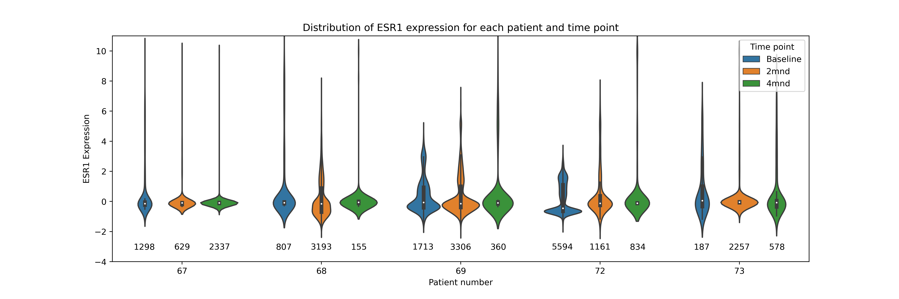

# Progress report

## Predict on positive part of new data
The models for the differentially expressed subset of the data (ESR1_expression > |0.5|) that are trained on the old dataset are not able to predict the expression of the cells in the new dataset. Exactly the same results occur if we use a model trained on the positive part of the old dataset and predict on postive part on the baseline in the new dataset (ESR1_expression > 0.5). 

### Results on old dataset

### Results on new dataset

## Training models on the new dataset
Completed grid search on baseline. Used differentially expressed cells i.e. |ESR1 exp|>0.5. 
Data split using and tuned on `X_train` with 1000 input genes: 

`X_train, X_test, X_val, y_train, y_test, y_val = modules.train_test_val_split(X, y, random_state=10)`

BEST_PARAMATERS:
- max_depth  :  3
- min_child_weight  :  1
- subsample  :  0.8
- eta  :  0.02

The tuning took 1 hour 49  minutes.

This is currently rerun with a finer grid and lower learning rates.
Using: 
`X_train, X_test, X_val, y_train, y_test, y_val = modules.train_test_val_split(X, y, random_state=10)`

`X_train = pd.concat([X_train, X_val])`
`y_train = pd.concat([y_train, y_val])`

## Data distribution
In the NeoLet dataset we see a similar imbalance between patients where patient 72 represents the biggest share of the cancer cells.
Distribution of ESR1 across patients. 

In the first dataset patient 54 has the most cells and the most cells that are differentially expressed.

## Model analysis

To investigate if there is a significant difference between patients we plot the predictions of a model and color them by patient. Patient 53 and 54 represent the majority of the data because they have the most differentially expressed cells.

It is hard to see any significant effect of the patient number. However, they seem to be grouped, but this is because the test set here has a random sample where some patients overrepresent in the negatively expressed.

### Leaving one patient out
I have done this on the first (old) dataset with poor results. Below is the training progress with the test set being patient 53 and only considering differentially expressed cells. The minimum is at RMSE=1.56 compared to the RMSE around 1.0 when we mix the patients in training and testing. We also see here how the model overfits to the patients in the training set. This trend is similar for all the patients with most not going below RMSE = 3.0

With these results we can likely conclude that we can not generalize beyond the patients in the training set. 

This suggests that there is more variance between patients than within patients or at least that the in-patient-variation is not similar across patients. For the NeoLetExe dataset I am not able to distinguish between the patients in the UMAP clustering, which could indicate that the cells are more similar across patients than within patiens, but these results suggest otherwise. The UMAP result might also be due to the fact that the UMAP is clustered to distinguish between cell types and not between patients. 

With the model used here it is in some way analogous to having 13 data points and predicting on a 14th, and it is unreasonable that 13 datapoints will represent an entire population. Especially when the actual data used is so unbalanced between the 13 datapoints where some individuals are almost not represented. The model is extrapolating from a small handful of patients to a new one. 

# Dummy encoding of patient numbers
I have done this and the patient variables have shapley values of 0. In a recent lecture with Riccard de Bin he presented a method he used to force the model to use some variables more often. He didn't explain it fully, but I plan to talk to him to see if he has any good suggestions. He had worked with genetics data to predict survival. 
